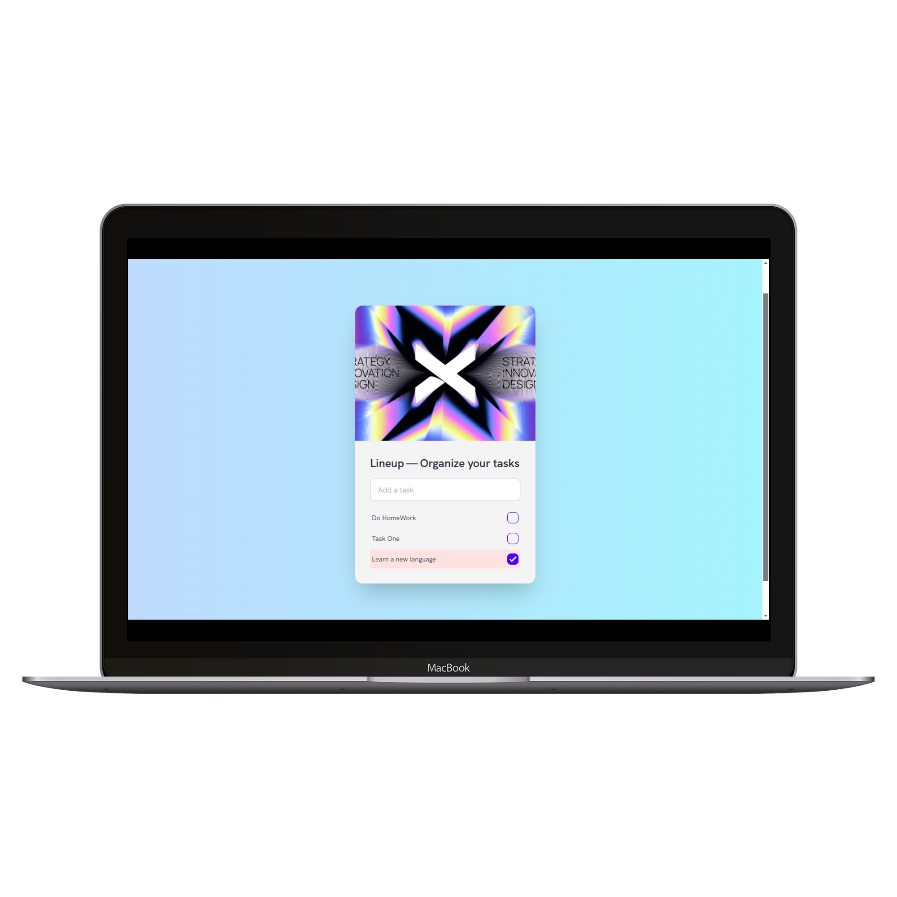

# Lineup

A simple to-do list app built with Tailwind CSS and localForage.



## Features

- Local storage using localForage
- Dark mode
- Responsive design
- Keyboard navigation
- Task sorting
- Task completion
- Task deletion

## Getting Started

To get started, follow these steps:

1. Clone the repository:

```bash
git clone https://github.com/gliese-backup/lineup.git
```

2. Install the dependencies:

```bash
npm install
```

3. Run the development server:

```bash
npm run dev
```
